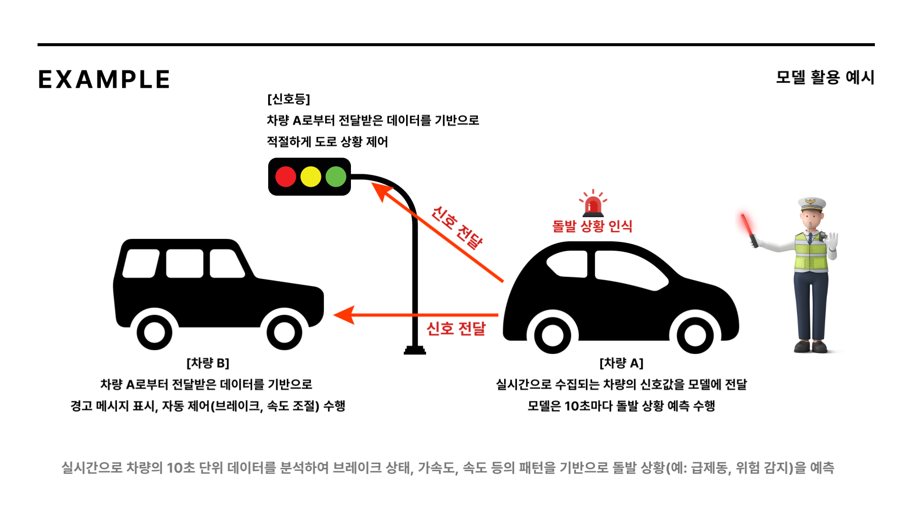
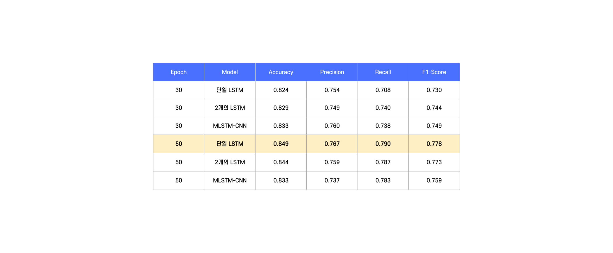

# V2X 송수신 데이터를 활용한 돌발 상황 인식 모델
## 1. 도로 교통 안전의 중요성
현재의 교통 사고 방지 시스템은 대부분 사고 발생 이후의 대응에 초점

## 2. V2X 데이터의 활용 가능성
기존의 교통 사고 방지 시스템은 주로 센서 기반 데이터 (카메라, 레이더 등)에 의존

높은 비용과 제한된 범위라는 한계점

반면, V2X 데이터는 도로 전체 상황을 실시간으로 수집할 수 있어 기존 기술의 한계를 극복할 수 있는 가능성 제공

### 💡 V2X 데이터의 차량 움직임 (차선 변경, 회전, 속도 변화 등) 기반으로 돌발 상황 인식 모델 개발

# Dataset
노변기지국 송·수신 V2X 메시지 데이터

각 차량의 10초 동안의 주행 정보를 가진 시계열 데이터

Download : https://aihub.or.kr/aihubdata/data/view.do?currMenu=&topMenu=&aihubDataSe=data&dataSetSn=71606

# Setting
- CPU : AMD Ryzen 9 7900 12-Core Processor
- GPU : RTX 4070 Super (VRAM 12 GB)
- SYSTEM : x64 based processor
- Windows 11
---
- CUDA Version : 11.2
- NVDIA Driver Version : 566.14
- cuDNN Version : 8.1.0
---
- Python Version : 3.10.11
- tensorflow Version : 2.10.0
---
⚠️ Docker 환경에서 학습하지 않았으므로 위에서 제시한 학습 환경과 동일한지 확인 필수

# Description
## **Merge.ipynb**
데이터셋의 모든 csv 파일 병합하여 하나의 csv 생성

## **EDA.ipynb**
- 데이터 확인
- 결측치 처리
- 기본 통계 분석
- 차량 운행 상황 별 지도에 시각화 (map 폴더 참조)

## **Undersampling.ipynb**
- 정상 주행 데이터들만 모아서 normal.csv로 저장
- 돌발 상황 데이터들만 모아서 hazard.csv로 저장
- 정상 주행 데이터가 돌발 상황 데이터보다 압도적으로 많으므로 언더샘플링 수행하여 balanced.csv로 저장
- 정상 주행 데이터 : 돌발 상황 데이터 = 2 : 1 비율로 언더샘플링

## **Split.ipynb**
Train : Validation : Test = 70 : 15 : 15

## **LSTM.ipynb**
- 10초 동안의 차량 데이터를 하나의 시퀀스로 생성
- Hazard 칼럼의 값들이 target, 나머지 칼럼의 값들이 input
---
#### 1. 스케일러 학습
StandardScaler 통해 훈련 데이터에서 각 피처의 평균 및 표준편차 학습
#### 2. 정규화
학습된 스케일러 사용해 훈련, 검증, 테스트 데이터 값 정규화 (평균 0, 표준편차 1)

## **MLSTM-CNN.ipynb**
#### 1. input_shape
- 입력 데이터 형태 : (time_steps, features)

- 시계열 특성을 포함한 2차원 데이터
#### 2. LSTM Layer
입력 데이터를 시간 순서대로 처리하여 시계열 데이터 패턴 학습

#### 3. CNN Layer
- 시계열 데이터를 처리하여 중요 패턴 & 특징 추출

- 필터 크기 : 64, 커널 크기 : 3, 활성화 함수 : ReLU

#### 4. MaxPooling

#### 5. Flatten Layer
CNN Layer 출력 데이터를 1차원 벡터로 변환하여 Fully Connected Layer로 전달

#### 6. Dense Layer
- CNN과 LSTM에서 추출된 특징 기반으로 최종 학습 수행
- 뉴런 개수 : 128, 활성화 함수 : ReLU

#### 7. Output Layer
- 클래스 수 (num_classes)에 따라 출력
- 이진 분류 수행하므로 활성화 함수로 sigmoid 사용

## **Simulation.ipynb**
- 모델이 실제로 어떤 식으로 활용될 수 있는지 시뮬레이션

# Model
1. 단일 LSTM
2. 2개의 LSTM
3. MLSTM-CNN

# Result

Epoch = 50으로 학습한 단일 LSTM 모델의 성능 가장 높음